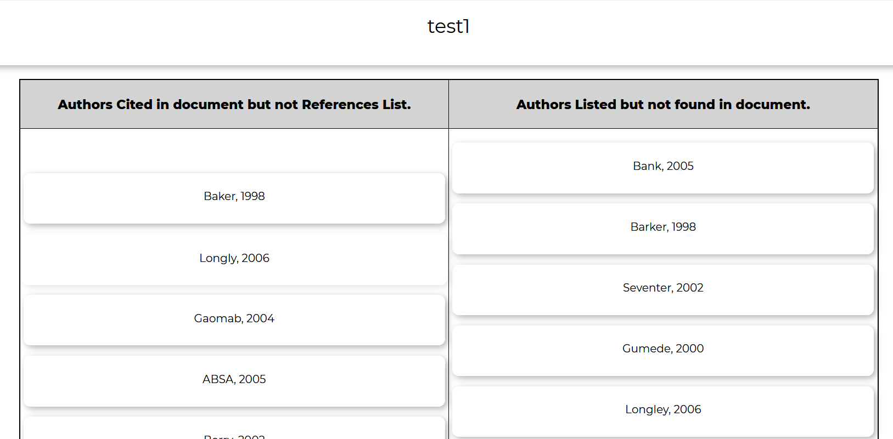
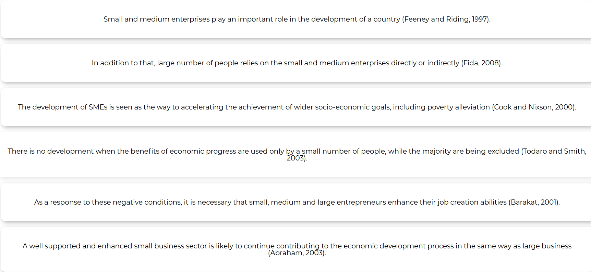

<!-- comment-->
# Reference-Finding-Software

## APA style reference finding software.


This project is a reference finding tool written with python which finds the 
* list of authors(including the year) cited within a text document(Journal, thesis e.t.c). 
* It also gets the list of all the references within the **REFERENCES** list for comparison.


It was developed for students, teachers and anyone who has a need for some form of technical report writing. It works for files written in txt, pdf or docx (Microsoft word document) format.


## Prequisites
1. Python 3.6 ++
2. Install the requirements:
    ```sh
    $ pip3 install -r requirements.txt
    ```


## Steps for use:
1. In your terminal type in:

    ```sh
    $ python file_input.py
    ```

2. input the file path of the file you want to generate results for. For example:

    ```sh
    $ Input file path: C:\User\Documents\file_name.docx
    ```


It is not perfect and might not always find all the references; However, it is open to contributions as it is open source.


If you just want to view the result without having to clone this repository, You can check this [website](https://master.d37nks6bxq57oj.amplifyapp.com/). 

### Comparison Table
<p align="center">

</p>

### List of References within the document
<p align="center">

</p>

### List of Authors cited in text
<p align="center">

</p>

I did the frontend for the [website](https://master.d37nks6bxq57oj.amplifyapp.com/) in 2020, it was one of my first frontend projects and also my first react project so you have to forgive me for its ugliness. 

> P.S. you have to sign up or log in to access the website.  
